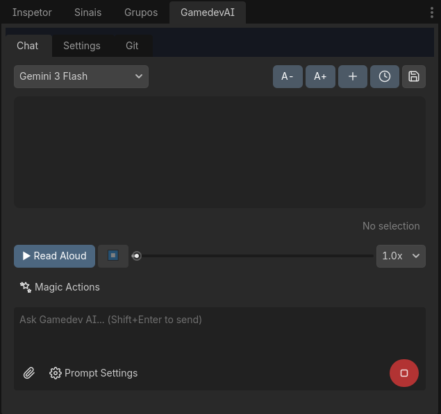
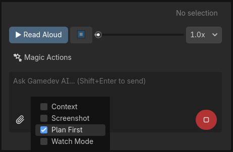
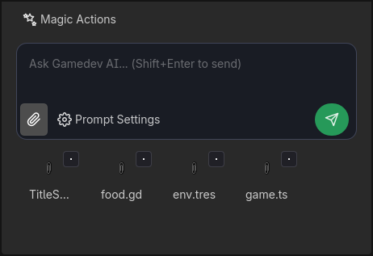
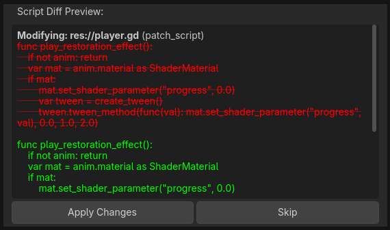

<h1 align="center">Gamedev AI</h1>

  <b>Agentic AI Assistant for Godot Engine 4.6+</b>

  Integrate AI models directly into your Godot workflow. Gamedev AI is an autonomous assistant that doesn't just provide suggestions — it interacts directly with your project. From constructing scene hierarchies to refactoring code and managing project memory, it helps you build your game both visually and logically.

---

*(Drop a screenshot of the main chat UI here)*

## 🚀 Features

### 🧠 Core Agentic Capabilities
- **🛠️ Agentic Tools**: The AI can autonomously `add_node`, `set_property`, `instance_scene`, `patch_script`, `create_scene`, `connect_signal`, `search_in_files`, and more — directly in the live editor.
- **👁️ Context Awareness**: Automatically gathers context from your **Active Scene**, **Open Scripts**, **Project Structure**, and takes **Viewport Screenshots** for visual guidance.
- **💾 Persistent Project Memory**: The AI remembers architectural decisions, naming conventions, and project facts across different sessions. It learns your game as you build it!
- **📋 Plan First Mode**: For complex tasks, ask the AI to generate a step-by-step numbered plan before executing any changes. Review the plan, then click "Run Plan" to watch it work.
  

*(Drop a screenshot of the Plan First toggle and Run Plan button here)*

### ⚡ Workflow Accelerators
- **💡 Quick Suggestions**: At the end of every response, the AI provides clickable "Smart Actions" to instantly trigger the logical next steps in your workflow.
- **🔍 Code Search Tool**: The AI can use Regex to search across your entire codebase (`search_in_files`) to find where variables, functions, or specific logic are used.
- **🐞 Watch Mode & Error Auto-Fix**: Automatically monitors your console logs. When a new error appears, the AI will intercept it, read the relevant context, and propose a fix.
- **🔄 File Watcher / Auto-Refresh**: Dropped a file into the chat for context? If you modify it externally, the plugin automatically stays in sync.
- **🖼️ Multimodal Input & Drag-and-Drop**: Paste images directly into the chat (Ctrl+V) or Drag & Drop scripts and scenes from the FileSystem dock to instantly add them to the AI's context window.

*(Drop a screenshot showing dragged files in the context preview here)*

### 🛡️ Safety & Control
- **👀 Diff Preview**: Before applying any code modifications, review a clean visual Diff of what the AI is about to change. Accept or Reject with a single click.
- **🛑 Stop AI**: Catch the AI doing something wrong? Instantly halt its execution stream.
- **↩️ Built-in Composite Undo**: A robust, session-aware undo system that reverts multiple AI actions (node creations, property changes, and script edits) in a single batch.
- **⚠️ Destructive Action Confirmation**: File deletions and node removals require user confirmation before proceeding.
- **🎮 Game State Detection**: The plugin pauses destructive agentic actions if it detects that your game is currently running to prevent file locks and data corruption.

*(Drop a screenshot of the Diff Preview panel here)*

### ⚙️ Customization & Providers
- **🤖 Multi-Provider Support**: Works flawlessly with **Google Gemini** and **OpenAI / OpenRouter** APIs.
- **🎭 Custom System Prompts**: Inject your own rules and developer personas into the AI's core instructions.
- **⚙️ Presets System**: Configure multiple API providers and models, and switch between them instantly using the sleek dropdown UI.
- **🔠 Scalable UI**: Adjust the chat font size on the fly for better readability.

---

## 📦 Installation

1. Copy the `addons/gamedev_ai` folder into your Godot project's `res://addons/` directory.
2. Go to **Project Settings > Plugins** and enable **Gamedev AI**.
3. A new tab named **Gamedev AI** will appear in your editor docks (usually on the right).

---

## ⚙️ Configuration

1. Obtain an API key from [Google AI Studio](https://aistudio.google.com/) or your preferred OpenAI-compatible provider.
2. In the Godot Editor, navigate to the **Settings** tab in the Gamedev AI dock.
3. Click **Edit** to configure your API Provider, Model, and Key. It will be saved securely in your local Editor Settings.
4. You can create multiple presets and switch between them directly from the main Chat tab.

*(Drop a screenshot of the new pristine Settings UI with the Edit panel open here)*

---

## 🗺️ Project Structure

- **`gamedev_ai.gd`**: Main plugin entry point. Manages provider initialization, dock setup, and preset coordination.
- **`ai_provider.gd`**: Base class for AI providers. Handles timeout, retry logic, session management, and lifecycle signals.
- **`gemini` & `openai` providers**: Implementations for respective APIs.
- **`tool_executor.gd`**: The "hands" of the assistant. Executes scene and file manipulations using Godot's `EditorInterface` with full undo/redo support.
- **`context_manager.gd`**: The "eyes" of the assistant. Collects scene tree data, script content, project structure, and viewport screenshots.
- **`memory_manager.gd`**: The "hippocampus". Handles long-term persistence of project decisions across chat sessions.
- **`system_prompt.gd`**: Defines the AI's system instructions and behavioral guidelines.
- **`gdscript_codex.gd`**: Comprehensive GDScript 4.6.1 best practices reference injected into the system prompt.
- **`dock/dock.tscn` & `dock/dock.gd`**: The main User Interface, event coordinator, and UI logic.

---

## 🛠️ Roadmap (Upcoming Features)

- **Streaming Responses**: Token-by-token response display for instant feedback.
- **Context Window Management**: Smarter pruning of history to preserve core project instructions.
- **Error Context Enhancement**: Auto-fetching full script blocks when Watch Mode detects console errors.
- **Scene Visual Preview**: Snapshots of created scenes directly inside the chat.

---

## ⚖️ License

Distributed under the MIT License. See `LICENSE` for more information.
