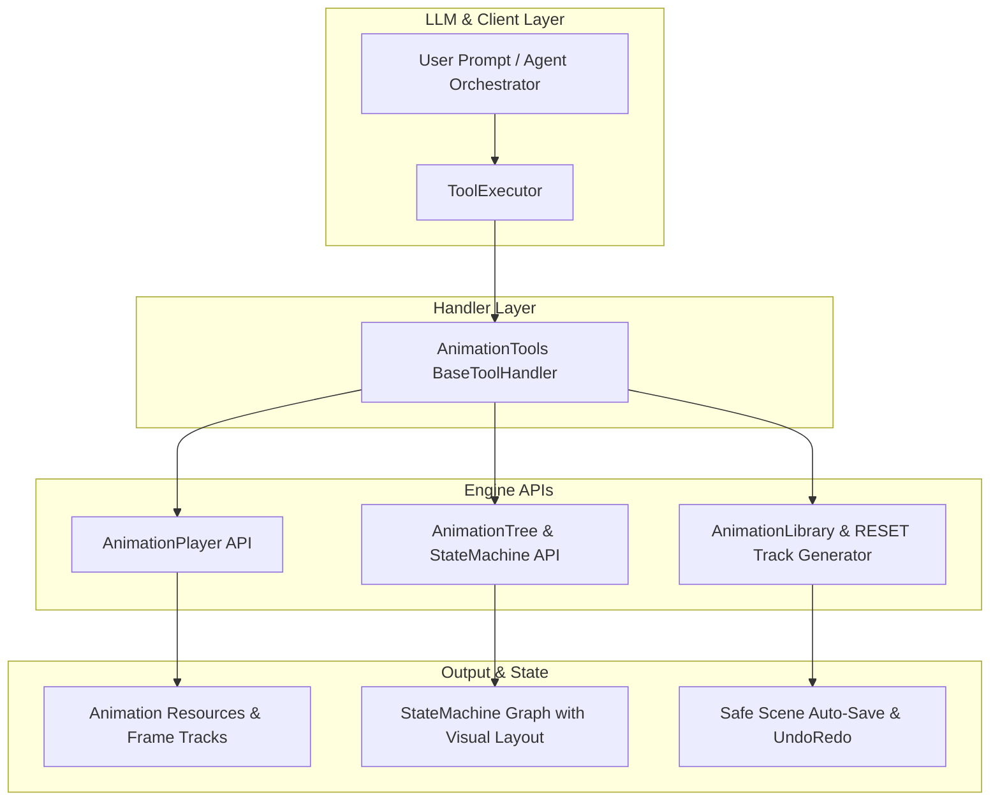

# Plano Arquitetural Premium: Animation & State Machine Tools (AnimationPlayer & AnimationTree)

**Arquivo:** `docs/PLAN-animation-tools.md`  
**Autor:** `project-planner` / `game-developer`  
**Status:** Atualizado com Especificação Premium (Godot 4.3+)  

---

## 🎯 1. Visão Geral & Objetivos
Este plano define a arquitetura para o módulo de animações do plugin `Gamedev AI`, fornecendo ferramentas para criar, configurar e inspecionar programaticamente suítes completas de animação 2D e 3D no **Godot 4.3+**. 

O módulo contempla desde animações atômicas de propriedades e spritesheets até grafos de **`AnimationNodeStateMachine`** com auto-layout visual, **`AnimationNodeBlendSpace2D`**, trilhas de eventos/métodos (`TYPE_METHOD`), áudio sincronizado e o gerador de alto nível **`setup_character_animation_suite`**.

---

## 🏗️ 2. Arquitetura do Módulo `AnimationTools`

---

## 🛠️ 3. Catálogo Completo das 9 Ferramentas Premium

### 🎬 A. Núcleo do `AnimationPlayer`

#### 1. `create_animation`
* **Descrição:** Cria ou atualiza uma animação dentro de um nó `AnimationPlayer`, gerenciando trilhas de valores (`TYPE_VALUE`), interpolações (`CONTINUOUS`, `DISCRETE`, `CAPTURE`), snapping e modos de loop (`NONE`, `LINEAR`, `PINGPONG`).
* **Parâmetros:**
  * `player_node_path`: `STRING` (ex: `"AnimationPlayer"` ou `"Player/AnimationPlayer"`)
  * `animation_name`: `STRING` (ex: `"walk_down"`, `"attack"`, `"jump"`)
  * `library_name`: `STRING` (default: `""` para biblioteca padrão)
  * `length`: `FLOAT` (duração em segundos, ex: `0.8`)
  * `loop_mode`: `STRING` (`"none"`, `"linear"`, `"pingpong"`)
  * `tracks`: `ARRAY` de dicionários contendo:
    * `node_path`: Caminho relativo ao nó animado (ex: `Sprite2D:frame` ou `.:position`)
    * `property`: Nome da propriedade ou método
    * `track_type`: `"value"`, `"method"`, `"transform2d"`, `"bezier"`
    * `update_mode`: `"continuous"`, `"discrete"`, `"capture"`
    * `keys`: `[{"time": float, "value": any, "transition": float}]`

#### 2. `setup_spritesheet_animation`
* **Descrição:** Automatiza a geração de animações 2D por spritesheet ou atlas grid para nós `Sprite2D` / `AnimatedSprite2D`, calculando os índices sequenciais de `frame` ou `frame_coords` com FPS e snap precisos.
* **Parâmetros:**
  * `player_node_path`: `STRING`
  * `sprite_node_path`: `STRING` (ex: `"Sprite2D"`)
  * `animation_name`: `STRING` (ex: `"run"`)
  * `start_frame`: `INTEGER` (frame inicial na folha)
  * `frame_count`: `INTEGER` (quantidade total de frames da ação)
  * `fps`: `FLOAT` (default: `10.0`)
  * `loop_mode`: `STRING` (`"linear"`, `"none"`, `"pingpong"`)
  * `auto_create_reset`: `BOOLEAN` (default: `true`, gera o track `RESET` no frame inicial)

#### 3. `add_animation_event_track` ⭐ *(Novo)*
* **Descrição:** Insere eventos pontuais em momentos exatos da animação:
  * **Trilhas de Método (`TYPE_METHOD`):** Disparo de funções (ex: `_enable_hitbox()`, `_disable_hitbox()`, `_spawn_dust()`).
  * **Trilhas de Áudio / Propriedade:** Sincronização de passos ou ativação de colisores (`CollisionShape2D.disabled = false`).
* **Parâmetros:**
  * `player_node_path`: `STRING`
  * `animation_name`: `STRING`
  * `event_type`: `STRING` (`"method"`, `"property"`)
  * `target_node_path`: `STRING` (nó alvo do evento)
  * `timestamp`: `FLOAT` (segundo exato na linha do tempo)
  * `method_name_or_property`: `STRING` (nome da função a invocar ou propriedade a alterar)
  * `method_args_or_value`: `VARIANT` (argumentos do método ou valor da propriedade)

#### 4. `inspect_animation_player`
* **Descrição:** Inspeciona o nó `AnimationPlayer`, listando todas as bibliotecas, animações registradas, durações, trilhas ativas e modo de loop para dar contexto ao LLM.
* **Parâmetros:**
  * `player_node_path`: `STRING`

---

### 🌲 B. Núcleo do `AnimationTree` & Máquinas de Estado

#### 5. `create_state_machine`
* **Descrição:** Cria ou configura um nó `AnimationTree` completo com raiz `AnimationNodeStateMachine`. Inclui **algoritmo de auto-layout de grafo** para evitar nós sobrepostos em `(0, 0)` no editor visual do Godot.
* **Parâmetros:**
  * `tree_node_path`: `STRING` (ex: `"AnimationTree"`)
  * `anim_player_path`: `STRING` (default: `"../AnimationPlayer"`)
  * `states`: `ARRAY` de dicionários:
    * `name`: `"idle"`
    * `animation`: `"idle"` (ou blend space associado)
    * `position`: `[x, y]` opcional (se omitido, o layout calcula automaticamente)
  * `transitions`: `ARRAY` de dicionários:
    * `from`: `"idle"`, `to`: `"walk"`
    * `advance_mode`: `"auto"`, `"enabled"`, `"disabled"`
    * `advance_condition`: `"is_moving"` (booleano)
    * `advance_expression`: `"velocity.length() > 5.0"` (expressão GDScript)
    * `xfade_time`: `FLOAT` (tempo de crossfade suave, default: `0.15`)
    * `switch_mode`: `"immediate"`, `"at_end"`, `"sync"`
  * `start_state`: `STRING` (estado inicial)
  * `set_active`: `BOOLEAN` (default: `true`)

#### 6. `create_blend_space_2d`
* **Descrição:** Cria e configura um nó `AnimationNodeBlendSpace2D` (para movimentação direcional 4D ou 8D) e o insere na máquina de estados ou árvore de blend.
* **Parâmetros:**
  * `tree_node_path`: `STRING`
  * `state_name`: `STRING` (ex: `"MoveSpace"` ou `"IdleSpace"`)
  * `blend_points`: `ARRAY` de dicionários `[{"pos": [0, 1], "animation": "walk_down"}, {"pos": [0, -1], "animation": "walk_up"}, ...]`
  * `blend_mode`: `STRING` (`"interpolated"`, `"discrete"`)
  * `min_space`: `ARRAY` `[-1.0, -1.0]`
  * `max_space`: `ARRAY` `[1.0, 1.0]`

#### 7. `connect_state_machine_transition`
* **Descrição:** Conecta ou atualiza transições individuais entre estados existentes de um `AnimationNodeStateMachine`.
* **Parâmetros:**
  * `tree_node_path`: `STRING`
  * `from_state`: `STRING`
  * `to_state`: `STRING`
  * `advance_condition`: `STRING` (opcional)
  * `advance_expression`: `STRING` (opcional)
  * `advance_mode`: `STRING` (`"auto"`, `"enabled"`, `"disabled"`)
  * `xfade_time`: `FLOAT`
  * `switch_mode`: `STRING` (`"immediate"`, `"at_end"`, `"sync"`)

#### 8. `inspect_animation_tree`
* **Descrição:** Retorna a estrutura completa do grafo do `AnimationTree`: estados cadastrados, blend spaces com seus pontos vetoriais, transições ativas e parâmetros de playback.
* **Parâmetros:**
  * `tree_node_path`: `STRING`

---

### 🚀 C. Suíte Completa All-In-One

#### 9. `setup_character_animation_suite` ⭐ *(Studio-Grade)*
* **Descrição:** Em uma única operação atômica, constrói a arquitetura completa de animação de um personagem 2D/3D:
  1. Cria e configura o nó `AnimationPlayer`;
  2. Cria o track padrão `RESET`;
  3. Cria as animações configuradas (`idle`, `walk`, `run`, `jump`, `fall`, `attack`, `hurt`, `death`);
  4. Cria o `AnimationTree` com `AnimationNodeStateMachine`;
  5. Cria as transições automáticas interligando os estados com crossfades e condições de avanço;
  6. Gera o script boilerplate opcional com variáveis e métodos de controle prontos para uso em GDScript.
* **Parâmetros:**
  * `parent_path`: `STRING` (caminho do nó raiz do personagem, ex: `"."` ou `"Player"`)
  * `sprite_node_path`: `STRING` (ex: `"Sprite2D"`)
  * `animations_config`: `DICTIONARY` (mapeamento de cada ação para seus frames/fps)
  * `state_machine_config`: `DICTIONARY` (definição dos estados e transições)
  * `auto_create_tree`: `BOOLEAN` (default: `true`)
  * `generate_helper_script`: `BOOLEAN` (default: `false`)

---

## 📐 4. Algoritmo de Auto-Layout Visual do Grafo

Para garantir que os estados criados em `AnimationNodeStateMachine` fiquem perfeitamente legíveis na interface do Godot:
* **Entrada (Start):** Posição `Vector2(0, 0)`
* **Idle (Repouso):** Posição `Vector2(250, 0)`
* **Movimentação (Walk/Run):** Posição `Vector2(550, 0)`
* **Ações Aéreas (Jump/Fall):** Posição `Vector2(250, -180)` e `Vector2(550, -180)`
* **Combate (Attack/Skill):** Posição `Vector2(250, 180)` e `Vector2(550, 180)`
* **Reações (Hurt/Death):** Posição `Vector2(850, 0)` e `Vector2(850, 180)`

---

## 📦 5. Detalhamento de Arquivos e Integração

| Arquivo | Ação | Descrição |
| :--- | :--- | :--- |
| `addons/gamedev_ai/tools/animation_tools.gd` | **[NOVO]** | Implementação completa dos 9 métodos de animação e máquina de estados |
| `addons/gamedev_ai/tool_executor.gd` | **[MODIFICAR]** | Registro de `AnimationTools`, argumentos obrigatórios em `_TOOL_REQUIRED_ARGS` e schemas JSON em `get_tool_definitions()` |
| `addons/gamedev_ai/orchestration/persona_config.gd` | **[MODIFICAR]** | Concessão das ferramentas aos papéis `SCENE_BUILDER` e `CODER` |
| `addons/gamedev_ai/test_animation_tools.gd` | **[NOVO]** | Suíte de testes automatizados para validação de `AnimationPlayer`, `AnimationTree`, `RESET` track e transições |

---

## 🧪 6. Plano de Validação e Testes Automatizados

* **Teste 1:** Criação programática de `AnimationPlayer` com `RESET` e animação com múltiplas chaves.
* **Teste 2:** Geração de animação por spritesheet com snapping e verificação de duração (`length`).
* **Teste 3:** Inserção de trilha de evento de método (`TYPE_METHOD`) e validação da chamada agendada.
* **Teste 4:** Criação de `AnimationTree` com `AnimationNodeStateMachine`, validação do posicionamento visual dos nós e configuração de `anim_player`.
* **Teste 5:** Conexão de transição com `advance_expression` e verificação de propriedades de crossfade (`xfade_time`).
* **Teste 6:** Execução da suíte completa `setup_character_animation_suite` em um nó `CharacterBody2D` com `Sprite2D`.
