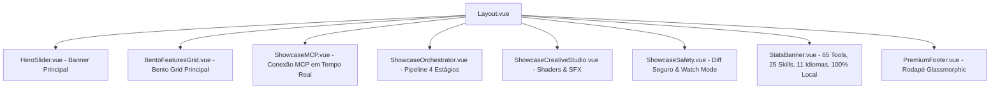

# PLAN: Redesign Premium da Página Inicial da Documentação (Landing Page 2.0)

> **Status:** Proposta & Planejamento  
> **Autor:** `project-planner` + `frontend-specialist` + `game-developer`  
> **Objetivo:** Transformar a página inicial da documentação do **Gamedev AI** em uma experiência visual de alto impacto (estilo Apple / Vercel / Linear para gamedevs), com estética Glassmorphism, Bento Grids interativos, micro-animações, demonstrações visuais ricas de cada grande subsistema (MCP, 65 Tools, Shaders, SFX, Multi-Agent, Safe Diff) e responsividade impecável.

---

## 🧭 1. Análise de Contexto e Diagnóstico

### 🔍 Estado Atual
* O Hero Banner possui um visual aceitável, mas a área inferior depende de uma grade simples de cartões 3x3 (`ModernFeatures.vue`) e 3 blocos estáticos (`FeatureShowcase.vue`).
* Grandes diferenciais da ferramenta (como o **Servidor MCP nativo**, o **Shader Studio com live viewport 3D/2D**, o **Sintetizador Procedural de SFX**, o **Pipeline de 4 Estágios com Auto-Cura** e o **Safe Diff Lado-a-Lado**) não possuem representações visuais dedicadas ou interativas na home.
* Falta dinamismo, contrastes luminosos (neon glow / cyan-blue accent), tipografia escalonada e micro-interações que "enchem os olhos" do desenvolvedor de jogos.

### ✨ Visão de Design da Landing Page 2.0
* **Glassmorphism Profundo & Efeito Frosted:** Cartões com `backdrop-filter: blur(24px)`, bordas gradientes translúcidas com reflexo de luz e sombras com dispersão colorida.
* **Bento Grid Moderno:** Layout assimétrico organizado por importância de funcionalidade (Hero Feature Cards maiores + Cards compactos com estatísticas e demonstrações visuais).
* **Seções Temáticas Interativas:**
  1. **🔌 Native MCP Server:** Demonstração visual do fluxo IDE (Antigravity/Cursor/Claude) ➔ Ponte Stdio ➔ Godot Editor (localhost:6543).
  2. **🤖 Multi-Agent Orchestrator & Auto-Healing:** Fluxo animado interativo de 4 estágios (`Architect` ➔ `Scene Builder` ➔ `Coder` ➔ `QA Tester`).
  3. **🎨 Shader & SFX Studios:** Mockup interativo com preview de shader em tempo real e sintetizador sonoro com visualizador de onda PCM.
  4. **🛡️ Safe Visual Diff & Watch Mode:** Demonstração interativa de comparação de código antes/depois e auto-correção de crash no console.
  5. **⚡ 65 Tools & 25 Skills Matrix:** Badge cloud dinâmica e interativa com filtros de categoria.
* **Micro-animações e Scroll Reveal:** Gradientes dinâmicos sutis ao passar o mouse (`glow hover tracking`), transições suaves e badges pulsantes.

---

## 🏗️ 2. Arquitetura Técnica dos Componentes (VitePress + Vue 3)



### 📁 Arquivos a Criar e Atualizar:

| Arquivo | Ação | Responsabilidade |
|---|---|---|
| `docs/.vitepress/theme/components/BentoFeaturesGrid.vue` | **Criar** | Grid no estilo Bento Box destacando os pilares centrais do Gamedev AI com animações hover. |
| `docs/.vitepress/theme/components/ShowcaseMCP.vue` | **Criar** | Seção visual interativa demonstrando o MCP conectando IDEs externas ao Godot Editor. |
| `docs/.vitepress/theme/components/ShowcaseOrchestrator.vue` | **Criar** | Demonstração animada do pipeline de 4 agentes e o loop de auto-cura (*Auto-Healing*). |
| `docs/.vitepress/theme/components/ShowcaseCreativeStudio.vue` | **Criar** | Showcase visual do Shader Studio (2D/3D live) e do gerador de SFX com onda sonora. |
| `docs/.vitepress/theme/components/ShowcaseSafety.vue` | **Criar** | Janela de Diff visual interativa (Antes/Depois) e simulação do Watch Mode corrigindo erros do console. |
| `docs/.vitepress/theme/components/StatsBanner.vue` | **Criar** | Faixa de métricas de impacto (65 Ferramentas, 25 Skills, 11 Idiomas, 100% Local & Seguro). |
| `docs/.vitepress/theme/Layout.vue` | **Atualizar** | Integrar os novos blocos na ordem de maior conversão e impacto visual. |
| `docs/.vitepress/theme/custom.css` | **Atualizar** | Tokens de Glassmorphism, animações de gradiente dinâmico (`@keyframes glow`), borders e tipografia. |
| `docs/index.md` & arquivos de idioma | **Atualizar** | Metadados e textos em destaque para alimentar os componentes de forma reativa e localizada. |

---

## 📋 3. Quebra de Tarefas e Fases de Execução

### 🎨 Fase 1: Design Tokens, CSS Glassmorphism & Micro-Animações
- [ ] Definir tokens de cores (Cyan `#00bae3`, Emerald `#10b981`, Amber `#f59e0b`, Rose `#f43f5e`, Purple/Violet banido conforme diretrizes de design, substituído por Electric Indigo `#3b82f6` e Godot Blue `#478cbf`).
- [ ] Implementar utilitários de `glass-panel`:
  ```css
  .glass-card {
    background: radial-gradient(120% 120% at 50% 0%, rgba(30, 34, 45, 0.6) 0%, rgba(15, 18, 26, 0.75) 100%);
    backdrop-filter: blur(20px);
    border: 1px solid rgba(255, 255, 255, 0.08);
    border-top: 1px solid rgba(255, 255, 255, 0.18);
    box-shadow: 0 16px 40px rgba(0, 0, 0, 0.45);
  }
  ```
- [ ] Criar animações de *shimmer*, bordas iluminadas dinâmicas e transições suaves de entrada com `IntersectionObserver`.

### 🧩 Fase 2: Bento Grid Principal (`BentoFeaturesGrid.vue`)
- [ ] **Card Grande 1 (Chat & Scene Tree Drag-and-Drop):** Mockup animado de nós da Scene Tree sendo arrastados para a conversa.
- [ ] **Card Grande 2 (Servidor MCP & IDEs):** Diagrama com conexões pulsantes entre Antigravity/Cursor/Claude e o Godot Editor.
- [ ] **Card Médio 3 (65 Tools Agentics):** Contador interativo com badges categorizadas (Animações, Masmorras, Terrenos, Shaders, SFX).
- [ ] **Card Médio 4 (Vector DB / RAG):** Visualizador de scanner de código com nó central de busca semântica.
- [ ] **Card Médio 5 (Git Manager Integrado):** Mini mockup da aba Git com auto-commit e branches.

### ⚡ Fase 3: Seções de Demonstração em Profundidade (*Deep Showcases*)
- [ ] **Showcase 1: Pipeline Multi-Agente & Auto-Cura:**
  - Card interativo onde o usuário pode alternar entre as 4 personas (`Architect`, `Scene Builder`, `Coder`, `QA Tester`) e ver a saída gerada por cada uma.
  - Indicador visual do loop de auto-cura (*Auto-Healing loop*).
- [ ] **Showcase 2: Shader Studio & Sintetizador de SFX:**
  - Janela de Shader Studio com slider interativo de `uniform` simulando alteração visual de Hit Flash / Dissolve.
  - Painel de SFX com botão de reprodução/mutação sonora e visualizador de ondas sonoras animadas.
- [ ] **Showcase 3: Safe Diff & Watch Mode:**
  - Janela interativa mostrando código antigo vs. código novo com destaques em vermelho/verde e botões de aprovar/rejeitar.
  - Simulação de erro no console e a IA gerando a solução instantaneamente.

### 🌐 Fase 4: Integração de Dados & Localização
- [ ] Atualizar os frontmatters de [docs/index.md](file:///c:/Users/Fred/Documents/game-dev/Gamedev%20Ai/docs/index.md) e de todos os idiomas para fornecer os textos traduzidos e metadados dinâmicos.
- [ ] Atualizar [docs/.vitepress/theme/Layout.vue](file:///c:/Users/Fred/Documents/game-dev/Gamedev%20Ai/docs/.vitepress/theme/Layout.vue) para montar os componentes com renderização SSR segura.

### 🧪 Fase 5: Teste de Performance & Validação
- [ ] Validar renderização em desktop e mobile (responsividade completa em telas < 640px, < 960px e > 1200px).
- [ ] Executar `npm run docs:build` e validar geração de bundle SSR sem erros de hidratação Vue.
- [ ] Checar performance de scroll e frame rate (60 FPS com backdrop-filter otimizado).

---

## ⛩️ 4. Portão Socrático (Perguntas de Alinhamento)

1. **Interatividade dos Shaders/SFX na Home:**
   - Deseja que o painel de SFX na landing page toque sons reais sintetizados via Web Audio API ao clicar no preview, ou prefere apenas uma animação gráfica da onda sonora?
2. **Distribuição das Seções:**
   - Prefere que todas as grandes funcionalidades fiquem em blocos roláveis verticais na página inicial ou prefere um sistema de abas interativas (*Tabs Showcase*) onde o usuário clica em "MCP", "Multi-Agent", "Shaders", "Safe Diff" para trocar o painel visual sem esticar excessivamente a página?

---

## 🏁 5. Checklist de Verificação

- [ ] Todos os novos componentes Vue 3 criados em `docs/.vitepress/theme/components/`.
- [ ] Design Glassmorphism aplicado com contrastes elegantes e micro-animações suaves.
- [ ] Compatibilidade total com o modo escuro padrão do VitePress.
- [ ] Sem quebra de layout em dispositivos móveis (smartphones e tablets).
- [ ] Todos os 11 idiomas carregando os textos correspondentes na home.
- [ ] `npm run docs:build` finalizado com código 0 e sem warnings.
