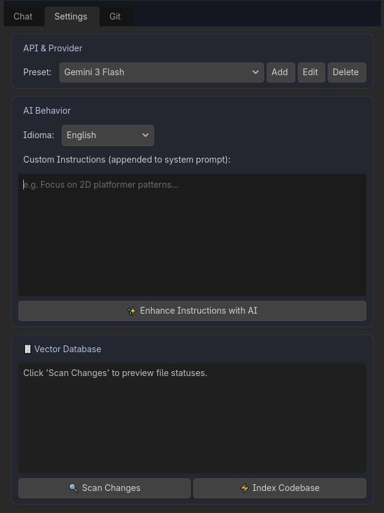

# Custom System Prompt

Às vezes, projetos de estúdio detém restrições rigorosas, e nós não queremos que a IA tome decisões genéricas pra todo o código criado. Como moldar o comportamento padrão "mental" do Gamedev AI?

## O Painel "Custom Instructions"

Na aba oculta **Settings**, abaixo do campo da provedor de "API Key".
Existe a grandiosa caixa livre **Instruções Personalizadas (Adicionadas ao Prompt)**.

Sempre que a IA "pensar" as instruções colocadas ali serão lidas como regra Número 1 universal antes dela te responder. 

### Exemplos do que colar nessa caixa:
* *"Por favor, não escreva explicações longas ou saudações, apenas mostre a janela de Diff focada"*
* *"Todo o projeto Godot deste estúdio usa convenção Clean Code. Métodos devem iniciar com letras minúsculas em inglês e nós da cena com PascalCase. Use Tipagem Fortemente Tipada (: String, : int, -> void) em rigorosamente todas as funções criadas."*
* *"Proíbo o uso das tags _process(). Quero que foque arquitetura com uso intenso de Signals para desempenho."*

Com isso, o Gamedev AI se transforma em um desenvolvedor moldado especificamente pelo CTO (Você) e criará códigos do jeito que sua equipe aprovar ao invés da sintaxe livre convencional dos LLMs.
