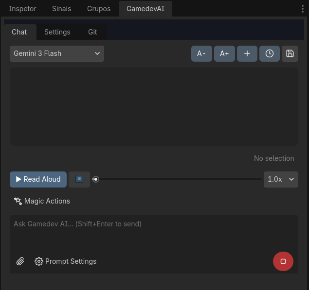
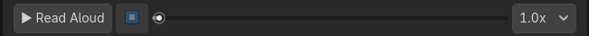

# Guia Completo da Interface (Todos os Controles e Abas)

Esta página descreve **cada botão, seletor, controle e aba** presente na interface do **Gamedev AI** dentro do editor Godot.

---

## 🗂️ Abas Principais

O plugin organiza suas capacidades em **5 abas e painéis integrados**:
- **💬 Chat** — Painel de conversa, execução de ferramentas, pipeline multi-agente e ações rápidas.
- **⚙️ Configurações** — Gerenciamento de provedores (Gemini, OpenAI/OpenRouter, Ollama, NIM), chaves de API, prompts customizados e indexação vetorial.
- **🐙 Git** — Controle de versão integrado ao GitHub com geração automática de mensagens de commit.
- **🎨 Shader Studio** — Sintetizador e editor visual de shaders com preview interativo em tempo real 2D/3D.
- **🔊 SFX Studio** — Gerador procedural de efeitos sonoros com reprodução e inserção na cena em um clique.

---

## 💬 1. Aba Chat

### Barra Superior
| Botão | Função |
|---|---|
| **Seletor de Preset** | Dropdown para trocar rapidamente entre configurações ativas (ex: "Gemini 3.1 Pro", "Claude 3.7 Sonnet", "Ollama DeepSeek"). |
| **A- / A+** | Diminui ou aumenta o tamanho da fonte da conversa. |
| **+ Novo Chat** | Limpa a conversa atual e reinicia o contexto de sessão. |
| **⊙ Histórico** | Dropdown com o histórico de conversas anteriores salvas para restaurar o contexto a qualquer momento. |
| **💾 Summarize to Memory** | Pede à IA para sintetizar as decisões arquiteturais da sessão e gravá-las na memória persistente do projeto. |

### Pipeline Multi-Agente (Chips Visuais)
Quando uma solicitação complexa é disparada, chips coloridos indicam o estado em tempo real da orquestração:
* 🟦 `Architect` — Estruturação de contratos e planejamento.
* 🟨 `Scene Builder` — Construção de nós e hierarquias `.tscn`.
* 🟩 `Coder` — Escrita de GDScript tipado e testes.
* 🟪 `QA Tester` — Execução de asserções e auto-cura (Auto-Healing).

### Player TTS (Text-to-Speech)

| Controle | Função |
|---|---|
| **▶ Ler em Voz Alta** | Sintetiza em áudio a última resposta da IA. |
| **⏹ Stop** | Interrompe a reprodução de áudio. |
| **Seek Slider** | Avança ou retrocede na faixa de áudio. |
| **Velocidade (1.0x - 2.0x)** | Ajusta a velocidade de reprodução da fala. |

### Botões de Ação Rápida
| Botão | O que faz |
|---|---|
| **✧ Refatorar** | Envia o código selecionado no editor de scripts para refatoração e otimização. |
| **◆ Corrigir** | Envia o código selecionado para correção imediata de bugs. |
| **💡 Explicar** | Envia o código selecionado solicitando explicação didática linha por linha. |
| **↺ Desfazer** | Reverte a última ação da IA usando o sistema nativo de Undo/Redo do Godot. |
| **🖥 Corrigir Console** | Lê os erros vermelhos do console de Output do Godot e envia direto para a IA propor o patch. |

### Área de Entrada & Envio
| Elemento | Função |
|---|---|
| **Campo de Texto** | Digite sua mensagem. Use `Shift + Enter` para nova linha ou `Enter` para enviar. |
| **📎 Anexar** | Abre um seletor para anexar imagens, capturas de tela ou scripts complementares. |
| **Drag & Drop** | Arraste nós da Scene Tree ou arquivos do FileSystem diretamente para o chat. Os metadados completos são anexados. |
| **➤ Enviar / ⏹ Parar** | Envia o prompt ou interrompe a geração da IA em andamento. |

### Configurações de Prompt (Dropdown ⚙️)
| Opção | Função |
|---|---|
| **Incluir Contexto** | Anexa automaticamente o script ativo no Editor de Scripts. |
| **Enviar Screenshot** | Tira uma screenshot da viewport/editor e anexa ao prompt (visão multimodal). |
| **Planejar Antes** | Exige que a IA produza um plano em Markdown antes de escrever qualquer código. |
| **Modo Vigiar** | Monitora silenciosamente o console de Output e sugere correções automáticas se o jogo falhar ao rodar. |

---

## 🎨 2. Aba Shader Studio

O **Shader Studio** integrado permite criar, editar e visualizar shaders GLSL (`.gdshader`) em tempo real dentro do dock do Godot.

| Controle | Função |
|---|---|
| **Seletor de Categoria** | Filtra presets por tipo (`Efeitos 2D`, `Materiais 3D`, `Pós-Processamento`, `Interface`). |
| **Seletor de Preset** | Escolhe entre shaders prontos: *Hit Flash, Dissolve, Hologram, Outline, Water, Pixelate, Glitch, Glow, Fire, Shield, etc.* |
| **Modo 2D / 3D** | Alterna o SubViewport de prévia entre Sprite2D e MeshInstance3D com iluminação. |
| **Viewport Interativo** | Janela de visualização ao vivo com rotação, zoom e animação do shader em tempo real. |
| **Painel Dinâmico de Uniforms** | Gera automaticamente sliders de números, seletores de cor e toggles para cada `uniform` do shader. |
| **Editor de Código com Recompilação** | Permite alterar o código GDShader e clicar em **Recompilar** para ver o efeito na hora. |
| **🎲 Randomizar** | Sorteia valores para todos os uniforms gerando variações estéticas imediatas. |
| **✨ Aplicar à Seleção** | Cria o `ShaderMaterial` e o anexa imediatamente ao nó selecionado na Scene Tree. |
| **💾 Salvar Shader** | Grava o shader (`.gdshader`) e o material (`.tres`) na pasta `res://shaders/`. |

---

## 🔊 3. Aba SFX Studio (Sintetizador Procedural)

Permite gerar efeitos sonoros com síntese PCM 100% nativa em GDScript (sem depender de bibliotecas externas):

| Controle | Função |
|---|---|
| **Presets Sonoros** | Pulo (`Jump`), Laser/Tiro (`Laser`), Explosão (`Explosion`), Moeda (`Coin`), Power-up, Dano (`Hit`), Clique de UI (`Click`). |
| **▶ Preview** | Executa o som sintetizado diretamente pelo `AudioStreamPlayer` interno. |
| **🎲 Mutate (Mutação)** | Aplica variações aleatórias controladas no envelope de frequência e pitch. |
| **💾 Salvar WAV** | Grava o áudio como `.wav` puro de 16-bit em `res://audio/sfx/`. |
| **➕ Inserir na Cena** | Cria automaticamente um nó `AudioStreamPlayer` com o stream configurado sob o nó selecionado. |

---

## ⚙️ 4. Aba Configurações

### Gerenciamento de Presets e Modelos
* **Provedores Suportados:** Google Gemini, OpenAI, OpenRouter, Ollama (Local), NVIDIA NIM.
* **Campos Configuráveis:** Nome do Preset, Chave da API, URL Base customizada, Nome do Modelo.
* **Seletor de Idioma:** Alterne instantaneamente entre 11 idiomas suportados (Português, Inglês, Espanhol, Francês, Alemão, etc.).

### Instruções Personalizadas & Aprimoramento
* **Custom System Prompt:** Regras permanentes de desenvolvimento.
* **✨ Enhance Instructions with AI:** Otimiza o prompt do sistema com boas práticas recomendadas para Godot 4.7+.

### Vector Database (RAG)
* **🔍 Scan Changes:** Identifica scripts novos e modificados no projeto.
* **⚡ Index Codebase:** Gera embeddings semânticos para alimentar a ferramenta `semantic_search`.

---

## 🐙 5. Aba Git & Controle de Versão

* **Inicialização e Remoto:** Configuração de URL remota GitHub e inicialização de repositório.
* **✨ Gerar Mensagem de Commit:** A IA lê as diferenças do código (`git diff`) e gera mensagens de commit padronizadas (Conventional Commits).
* **Gestão de Branches:** Criação e checkout de branches diretamente pela interface.
* **Ações de Emergência:** Desfazer alterações locais, Forçar Pull e Forçar Push com caixas de diálogo de confirmação.

---

## 📋 6. Painel de Diff Visual Seguro

Quando a IA propõe edições em scripts:
* **Visualização Lado-a-Lado:** Linhas removidas em vermelho e adicionadas em verde.
* **Aplicar:** Grava as mudanças no disco e registra no histórico de **Undo/Redo** do editor Godot.
* **Pular:** Descarta a alteração sem tocar no arquivo original.
