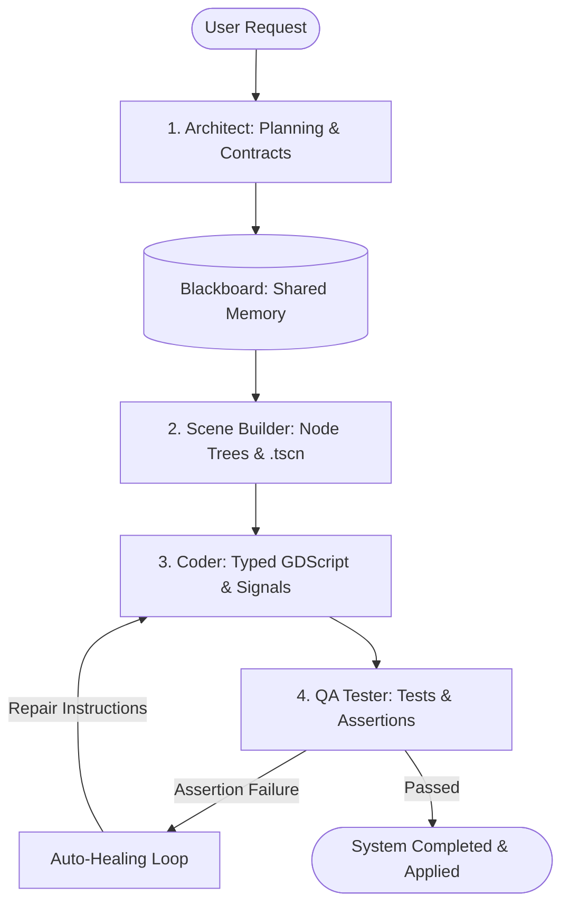

# 🧠 Multi-Agent Orchestration & Intelligence

**Gamedev AI** is powered by an autonomous, multi-agent engineering architecture integrating specialized personas, a 4-stage sequential pipeline, shared memory, and automatic self-healing (Auto-Healing).

---

## 🚀 Multi-Agent Orchestrator (4-Stage Pipeline)

For complex tasks (such as creating inventory systems, combat engines, or procedural dungeons), Gamedev AI engages the **Agent Orchestrator**:

### 1. 🟦 Architect Persona
* **Role:** Analyzes requests, defines required node structures, public interfaces, exported variables, and signals.
* **Output:** Architectural specification written to the shared memory (`Blackboard`).

### 2. 🟨 Scene Builder Persona
* **Role:** Builds visual and physical scene hierarchies (`.tscn`).
* **Tools:** `create_scene`, `add_node`, `set_property`, `attach_script`, `create_resource`.

### 3. 🟩 Coder Persona
* **Role:** Implements logic in modern GDScript with strict static typing (`:=`, `-> void`).
* **Tools:** `create_script`, `patch_script`, `connect_signal`, `get_lsp_diagnostics`.

### 4. 🟪 QA Tester & Auto-Healing
* **Role:** Executes structural assertions, node audits, and unit tests.
* **Auto-Healing:** If QA detects failures, the orchestrator loops back to the `Coder` persona with exact error reports to automatically repair code (up to 2 iterations without user intervention).

---

## 🗄️ Blackboard (Pipeline Shared Memory)

The **Blackboard** is the in-memory shared state carrying:
* Created nodes, script paths, connected signals, and approved architectural contracts.
* Ensures the `Coder` and `QA Tester` have exact access to node paths established by the `Scene Builder`.

---

## 🎭 Specialist Personas (Dynamic Routing)

During standard chat sessions, the AI automatically activates specialized domain personas:
* **Godot Expert:** Architecture, Singletons, Resources, and design patterns.
* **UI/UX Designer:** Responsive `Control` layouts, Glassmorphism themes, anchors, and controller navigation.
* **Technical Artist (Shader Artist):** GLSL canvas/spatial shaders, particle systems, and VFX.
* **Multiplayer Engineer:** Godot 4 NetCode, RPCs (`@rpc("authority", "call_local")`), and state sync.
* **Audio Specialist:** Procedural sound synthesis and audio bus management.

---

## ⛩️ Socratic Gate (Stop & Ask)

For critical and complex requests:
1. **Strategic Pause:** AI pauses generation on complex system requests.
2. **Trade-off Inquiries:** Asks edge-case questions (e.g. *"Should inventory be slot-based or weight-based?", "Do you prefer binary serialization or JSON?"*).
3. **Aligned Execution:** Plans are executed only after your confirmation.

---

## ⌨️ Slash Commands (/)

* `/brainstorm` — Idea discovery and Game Design Document (GDD) exploration.
* `/plan` — Generates a structural Markdown plan.
* `/debug` — Deep-dive investigation on stack traces and runtime errors.
* `/orchestrate` — Forces the full multi-agent pipeline execution.
