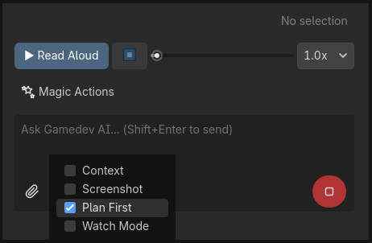
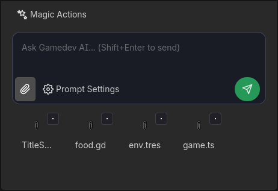

# চ্যাট, অ্যাটাচমেন্ট এবং কন্টেক্সট (Context)

চ্যাট মানে কেবল এডিটরের ডান পাশের উইন্ডোতে বিল্ট-ইন ChatGPT নয়। এটি আপনার **প্রজেক্ট ফাইল** এবং **AI এর মস্তিষ্কের** মধ্যে এক সত্যিকারের "শ্বাস-প্রশ্বাস নেওয়ার যন্ত্র"।

## "কন্টেক্সট" (আপনার বর্তমান কোড পড়া) এর গুরুত্ব

AI আপনার স্ক্রিন দেখতে পায় না এবং আপনি এই মুহূর্তে কী প্রোগ্রামিং করছেন তাও জানে না — *যদি না আপনি ওকে দেখতে বলেন!*

*"Send"* বারের নিচে আপনি একটি গুরুত্বপূর্ণ চেকবক্স দেখতে পাবেন যার নাম **Context**।
১. **সিলেক্ট করা (ডিফল্ট):** Gamedev AI নিঃশব্দে আপনার মউস যেখানে আছে সেই স্ক্রিপ্ট ফাইলের (`.gd`) প্রতিটি লাইন, প্রতিটি ক্যারেক্টার কপি করবে। আপনার জিজ্ঞাসার সাথে এই তথ্যটিও পাঠানো হবে!
২. **আন-সিলেক্ট করা:** পেইড মডেলে (OpenAI) কন্টেক্সট টোকেন বাঁচায়। কোড না দেখেই দ্রুত প্রশ্ন করুন, একদম সাধারণ ChatGPT এর মতো। এটি ইঞ্জিনের কন্টেক্সট প্রয়োজন নেই এমন আইসোলেটেড প্রশ্নের জন্য ব্যবহার করুন।

## 📸 স্ক্রিনশট (Auto-Screenshot)

কন্টেক্সট সুইচের পাশেই রয়েছে **Screenshot** সুইচ। এই ফাংশনটি AI কে লिटरালি Godot স্ক্রিনে কী ঘটছে তা "দেখার" অনুমতি দেয়।

### এটি যেভাবে কাজ করে
১. চ্যাটের নিচের বারে **"Screenshot" সুইচটি অ্যাক্টিভেট করুন**।
২. আপনার পাঠানো পরবর্তী মেসেজের সাথে সম্পূর্ণ Godot এডিটর উইন্ডোর একটি **স্বয়ংক্রিয় স্ক্রিনশট** যাবে।
৩. AI সম্পূর্ণ ইমেজটি পাবে এবং একটি ভিজ্যুয়াল বিশ্লেষণ করতে পারবে: খোলা থাকা 2D/3D সিন, সিন ট্রি, ইনস্পেক্টর (Inspector), আউটপুট এবং অন্য যেকোনো দৃশ্যমান প্যানেল।

### কখন ব্যবহার করবেন
- **ভেঙে যাওয়া UI:** আপনার গেমের ইন্টারফেস ঠিকমতো অ্যালাইন হয়নি এবং আপনি জানেন না কোন Label বা Container এর জন্য সমস্যা হচ্ছে? স্ক্রিনশট চালু করে পাঠান "এই লেআউটে কী সমস্যা আছে?", এবং AI নোডগুলোর ভিজ্যুয়াল অ্যানালাইসিস করবে।
- **জটিল সিন ট্রি:** আপনি চান AI ম্যানুয়ালি ডেসক্রিপশন না লিখে আপনার নোডগুলোর হায়ারার্কি কীভাবে সাজানো হয়েছে তা বুঝুক।

::: tip টিপস
AI এর কাছে `capture_editor_screenshot` টুলটিও রয়েছে যা সে চ্যাটের যেকোনো সময় নিজেই কল করতে পারে যদি মনে করে তার এডিটরে "একবার নজর দেওয়া" প্রয়োজন।
:::

## "প্ল্যান ফার্স্ট" (Plan First) বাটন

খুব সাধারণ একটি ভুল হলো AI কে একবারে একটি বিশাল RPG এর সম্পূর্ণ লজিক তৈরি করতে বলা। প্লাগিনটি আপনাকে **Plan First** অ্যাক্টিভেট করে রোবটের সেই অতিরিক্ত উত্তেজনা নিয়ন্ত্রণ করতে দেয়।

* **অ্যাক্টিভ:** প্লাগিন কঠোর নির্দেশনা পাঠাবে। *AI কোনো কোড জেনারেট করবে না*। এটি পরিবর্তন করার জন্য এলিমেন্টগুলোর (ক্লাস, নাম, প্রধান ফাংশন) একটি নম্বরযুক্ত Markdown লিস্ট দিয়ে উত্তর দেবে।
* প্ল্যানটি রিভিউ এবং কনফার্ম করার পর, **"Execute Plan"** বাটনে ক্লিক করুন যা অটোমেটিক হাজির হবে। কেবল তখনই AI তার পরিকল্পনা অনুযায়ী কাজ শুরু করবে।

## অ্যাটাচমেন্ট এবং ড্র্যাগ করা নোড

বিশ্লেষণ করা দরকার কীভাবে Sprite2D তৈরি হয়েছে অথবা কেন `Player.tscn` সিনটি `Ground` RigidBody3D এর সাথে সংঘর্ষ (collide) করছে না?

Gamedev AI ড্র্যাগ অ্যান্ড ড্রপ (Drag & Drop) সাপোর্ট করে। ইনস্পেক্টরে কৌতূহল বা ভিজ্যুয়াল বাগ তৈরি করে এমন প্রতিটি ট্যাব খুলে সময় নষ্ট করার প্রয়োজন নেই...

১. **সিন ট্রি (Scene Tree):** আপনার সিনের একটি নোডে ক্লিক করে লজিক প্যানেলে ড্র্যাগ করুন। AI সমস্ত নোড মেটাডেটা (হিডেন মোড, ইনস্ট্যান্স, কলিশন লেয়ার...) অ্যানালাইসিস করার শর্টকাট ব্যবহার করবে এবং বুঝবে কেন ঘর্ষণ ভেক্টর (friction vector) কাজ করছে না বলে মনে হচ্ছে।
২. **📎 অ্যাটাচমেন্ট বাটন:** ইমেজ (`.png` বাগ থাকা UI এর জন্য), র ফাইল আর্কিভ (`.json`) এবং লম্বা স্ক্রিপ্টের ফুল স্ন্যাপশট ইনসার্ট করতে এটি ব্যবহার করুন (aunque vector indexing as the more professional method).

---

## 🎙️ টেক্সট-টু-স্পিচ (TTS - Text-to-Speech)

Gamedev AI এর একটি বিল্ট-ইন **ভয়েস-ওভার প্লেয়ার** আছে যা AI এর উত্তরগুলিকে সাউন্ডে রূপান্তর করতে পারে। এটি আপনাকে প্রোগ্রামিং চালিয়ে যাওয়ার পাশাপাশি উত্তরগুলো শোনার সুবিধা দেয়, যাতে লম্বা টেক্সট পড়ার জন্য কাজ থামাতে না হয়।

### কীভাবে ব্যবহার করবেন
১. চ্যাটে AI এর উত্তরের পরে, **"▶ Read Aloud"** বাটনে ক্লিক করুন (চ্যাট এরিয়ার ঠিক নিচে অবস্থিত)।
২. প্লাগিনটি শেষ উত্তরের টেক্সট থেকে স্পিচ সিন্থেসিস করার রিকোয়েস্ট পাঠাবে।
৩. সমস্ত কন্ট্রোল সহ একটি কমপ্যাক্ট অডিও প্লেয়ার দেখা যাবে:

| কন্ট্রোল | ফাংশন |
|----------|--------|
| **▶ Read Aloud** | ভয়েস-ওভার শুরু করে। |
| **⏹ (স্টপ)** | সাথে সাথে প্লেব্যাক বন্ধ করে। |
| **প্রগ্রেস বার** | স্লাইডার ড্র্যাগ করে ভয়েস-ওভারে সামনে বা পেছনে যাওয়ার সুযোগ দেয়। |
| **স্পিড (1.0x থেকে 2.0x)** | ভয়েস-ওভারের গতি নিয়ন্ত্রণ করে। দ্রুত শোনার জন্য 1.5x বা 2.0x ব্যবহার করুন। |

### কখন এটি কার্যকর
- **লম্বা উত্তর:** AI কি `NavigationAgent3D` কীভাবে কাজ করে সে সম্পর্কে ৩টি প্যারাগ্রাফ ব্যাখ্যা করেছে? আপনি সিন ট্রিতে নোডগুলো সেট করার সময় এটি শুনুন।
- **অ্যাক্সেসিবিলিটি:** সেই সব ডেভেলপারদের জন্য যারা শুনে শিখতে পছন্দ করেন অথবা স্ক্রিনে লম্বা টেক্সট পড়তে সমস্যা বোধ করেন।
- **প্যাসিভ রিভিউ:** আপনি কফি খেতে যাওয়ার সময় AI কে রিফ্যাক্টরিং প্ল্যানটি পড়ে শোনাতে বলুন!

::: info নোট
TTS ফিচারটি আপনার কনফিগার করা প্রোভাইডারের API ব্যবহার করে সাউন্ড জেনারেট করে। অডিও ক্যাশ করা হয়, তাই পজ এবং রেজুম করলে অতিরিক্ত টোকেন খরচ হয় না।
:::

---

## ⚡ কুইক অ্যাকশন (Quick Actions)

চ্যাট এরিয়ার ঠিক নিচে (এবং টেক্সট ফিল্ডের উপরে) **৫টি কুইক অ্যাকশন বাটন** রয়েছে যা ইন্টেলিজেন্ট শর্টকাট হিসেবে কাজ করে। এগুলি Godot স্ক্রিপ্ট এডিটরে আপনার সিলেক্ট করা কোডের সাথে একটি প্রি-কনফিগার করা প্রম্পট অটোমেটিক পাঠিয়ে দেয়।

### এগুলি যেভাবে কাজ করে
১. Godot কোড এডিটরে **যেকোনো স্ক্রিপ্ট** (`.gd`) খুলুন।
২. মাউস বা কিবোর্ড দিয়ে **কোডের একটি অংশ সিলেক্ট করুন** (যেমন একটি পুরো ফাংশন, একটি `if` ব্লক বা কয়েক লাইন)।
৩. নিচের **বাটনগুলোর** মধ্যে একটিতে ক্লিক করুন:

### ৫টি বাটন

| বাটন | প্রেরিত প্রম্পট (Prompt Sent) | AI যা করবে |
|-------|---------------|----------------|
| **✧ Refactor** | "Refactor this code" | সিলেক্ট করা অংশটি অ্যানালাইসিস করবে এবং GDScript এর সেরা অনুশীলন অনুসরণ করে একটি ক্লিনার এবং আরও দক্ষ ভার্সন প্রস্তাব করবে। |
| **◆ Fix** | "Fix errors in this code" | ওই অংশে বাগ, সিনট্যাক্স এরর, ভুল টাইপ বা লজিক্যাল সমস্যা খুঁজে বের করবে এবং ডিফ (Diff) এর মাধ্যমে সমাধান জেনারেট করবে। |
| **💡 Explain** | "Explain what this code does" | কোডের কাজ কী তা লাইন বাই লাইন বাংলা ভাষায় ব্যাখ্যা করবে — শেখার বা ডকুমেন্টেশনের জন্য উপযুক্ত। |
| **↺ Undo** | *(সরাসরি অ্যাকশন)* | প্রোজেক্টে AI এর শেষ কাজটিকে আনডু (Undo) করবে (Godot এর নেটিভ Undo/Redo সিস্টেম ব্যবহার করে)। কোনো প্রম্পটের প্রয়োজন নেই। |
| **🖥 Fix Console** | *(আউটপুট পড়া)* | Godot আউটপুট কনসোল থেকে সাম্প্রতিক লাল এররগুলো পড়বে এবং ডায়াগনোসিস ও সমাধানের জন্য সরাসরি AI এর কাছে পাঠাবে। |

### "Fix Console" ব্যবহারের উদাহরণ
১. আপনি Godot এর মাধ্যমে গেমটি রান করেছেন (`F5`)।
২. একটি লাল এরর দিয়ে গেমটি ক্র্যাশ করেছে: `Attempt to call function 'die' in base 'null instance'`.
৩. কিছু কপি করার প্রয়োজন নেই, কেবল **🖥 Fix Console** এ ক্লিক করুন।
৪. AI নিজেই আউটপুট লগ পড়বে, সমস্যা সৃষ্টিকারী স্ক্রিপ্টটি খুঁজে বের করবে এবং একটি নিরাপদ ডিফ (Diff) এ সমাধানের প্রস্তাব দেবে।

::: tip টিপস
**"Fix Console"** বাটনটি **"Watch Mode"** এর থেকে আলাদা। কনসোলের জন্য ম্যানুয়াল ক্লিকের প্রয়োজন হয়, পক্ষান্তরে "Watch Mode" একবার চালু করলে ব্যাকগ্রাউন্ডে অটোমেটিক কাজ করে।
:::
