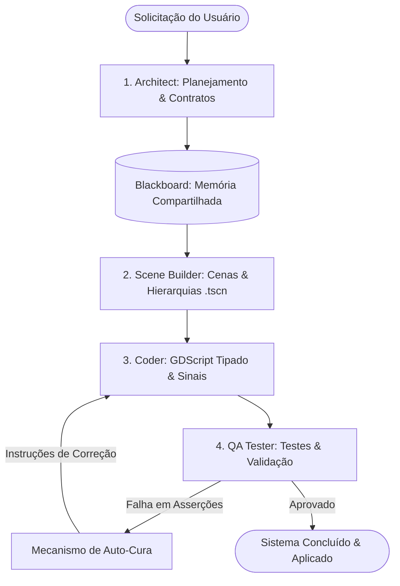

# 🧠 Agentes & Orquestração Inteligente

O **Gamedev AI** não é apenas um chat que escreve código. Ele é alimentado por uma arquitetura multi-agente autônoma de última geração, integrando personas especializadas, orquestração em pipeline, memória compartilhada e auto-cura (Auto-Healing).

---

## 🚀 Orquestrador Multi-Agente (Pipeline de 4 Estágios)

Para tarefas complexas de desenvolvimento (como a criação de um sistema de inventário, combate ou geração procedural), o Gamedev AI ativa o **Agent Orchestrator**, que executa um pipeline sequencial com especialistas dedicados:

### 1. 🟦 Architect Persona
* **Papel:** Analisa a solicitação, define os nós necessários, especifica as interfaces públicas, sinais e propriedades que serão implementadas.
* **Saída:** Especificação de arquitetura gravada na memória compartilhada (`Blackboard`).

### 2. 🟨 Scene Builder Persona
* **Papel:** Constrói a estrutura visual e física das cenas `.tscn`.
* **Ferramentas:** `create_scene`, `add_node`, `set_property`, `attach_script`, `create_resource`.

### 3. 🟩 Coder Persona
* **Papel:** Escreve a lógica pura em GDScript moderno com tipagem estática rigorosa (`:=`, `-> void`).
* **Ferramentas:** `create_script`, `patch_script`, `connect_signal`, `get_lsp_diagnostics`.

### 4. 🟪 QA Tester & Auto-Cura (Auto-Healing)
* **Papel:** Executa asserções arquiteturais, validação de nós e rotinas de teste.
* **Auto-Cura Automática:** Se o QA identificar erros ou asserções quebradas, o orquestrador re-executa a etapa do `Coder` com o relatório de falha para que o código seja reparado automaticamente (até 2 tentativas sem necessidade de intervenção do usuário).

---

## 🗄️ Blackboard (Memória Compartilhada do Pipeline)

O **Blackboard** é a estrutura de dados persistente em memória que acompanha toda a execução da pipeline:
* Armazena os nós criados, caminhos de scripts, sinais conectados e requisitos aprovados pelo arquiteto.
* Garante que o `Coder` e o `QA Tester` tenham acesso exato aos nomes e caminhos definidos pelo `Scene Builder`.

---

## 🎭 Personas Especialistas (Dynamic Routing)

Além do pipeline de orquestração, durante conversas normais a IA identifica o domínio da sua pergunta e carrega dinamicamente a persona correspondente:

* **Godot Expert:** Arquitetura geral, Singletons, Resources e padrões de projeto.
* **UI/UX Designer:** Layouts responsivos com `Control`, temas Glassmorphism, âncoras e navegação por controle.
* **Technical Artist (Shader Artist):** Shaders GLSL canvas/spatial, partículas e efeitos visuais.
* **Multiplayer Engineer:** NetCode do Godot 4, RPCs (`@rpc("authority", "call_local")`) e sincronização de estado.
* **Audio Specialist:** Síntese procedural de SFX e gerenciamento de barramentos de áudio.

---

## ⛩️ Portão Socrático (Stop & Ask)

Para evitar que a IA produza código genérico ou com premissas erradas em sistemas críticos:
1. **Parada Estratégica:** A IA identifica termos de alta complexidade.
2. **Perguntas de Trade-off:** Pergunta casos de borda e preferências (ex: *"Deseja que os dados sejam salvos em formato binário ou JSON?", "O inventário deve ser baseado em peso ou grade?"*).
3. **Execução Precisa:** O plano é gerado somente após o seu alinhamento.

---

## ⌨️ Workflows via Comandos Slash (/)

* `/brainstorm` — Modo de exploração de ideias e Game Design Document (GDD) sem geração prematura de código.
* `/plan` — Gera um plano estruturado de arquivos e nós em Markdown.
* `/debug` — Foca exclusivamente em leitura de stack trace, inspeção de runtime e causa raiz.
* `/orchestrate` — Força a execução do pipeline de múltiplos agentes para a tarefa.

---

## 🔍 Auto-Audit (Auditoria de Código & Cena)

Ao concluir alterações, o assistente pode executar autonomamente:
* `audit_script` — Análise estática do GDScript procurando referências inválidas e vazamentos de memória.
* `audit_scene` — Validação de integridade de nós e dependências de recursos `.tres`.
* `get_lsp_diagnostics` — Validação direta com o Godot Language Server.
