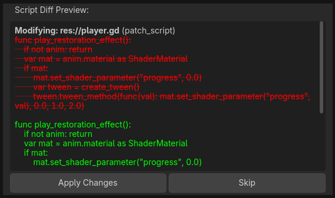

# A Tela de Diff (Luz Verde aos Coders)

O Gamedev AI escreve código de forma assíncrona. Isso significa que ele reescreve seu arquivo e edita dezenas de instâncias enquanto você lê o log na engine. 
Mas espere, dar controle de escrita automático para um robô no seu disco-rígido `.gd` não destrói as raízes autorais do desenvolvedor?

Não! *A Tela de Diff garante o seu emprego e projeto sem arranhados acidentais.* 

O plugin Gamedev AI implementa a "Janela Diff Safe View", comparável as visualizações famosas de versionamento (GitHub/GitLens) do VSCode.

## Como o Diff Acontece
1. Ao pedir criar ou arrumar um `EnemyAttack.gd`. O log acusa progresso de reescritura de metadados da classe...
2. Você ouvirá o "Ping" visual e uma **aba escura de Diff** com as palavras [Original Code] ao lado das [New Code Changes] surgirá instantaneamente invadindo a tela do chat com o texto.
3. Linhas destacadas **[color=red]em Vermelho -[/color]** representam códigos originais apagados perigosamente. 
4. Linhas destacadas **[color=green]em Verde +[/color]** representam a injeção inédita de inteligência da IA.

## Apply ou Skip (O Poder da Rejeição)

Ao final do Diff (Deslize a *scroll-bar* até o final ou analise friamente), aparecem botões decisivos de segurança:
* **"Apply Changes" (Aplicar Mudanças):** O Gamedev AI usará a Proxy de Histórico Undo/Redo oficial do Godot Engine e vai modificar o script alvo real. Se você der `Ctrl + Z` no script, voltará antes da IA assumir.
* **"Skip" (Pular / Ignorar):** Detestou a ideia engessada do LLM após o Diff? Aperte "Skip". Nenhuma linha real será alterada (nem no Cache) e não há prejuízo técnico, apenas os *tokens* foram queimados.

> _(Visualize na prática como funciona o Diff:)_

