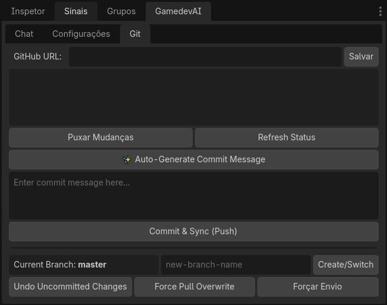

# Tab Git dan GitHub (Otomatisasi Versi)

Pengembang pemula di Godot sering kali panik saat tiba waktunya untuk *melakukan commit* pada puluhan file biner yang tidak dimengerti (scene, tekstur, sumber daya). Melakukan penggabungan (Merge) di terminal sangat melelahkan.

Itulah sebabnya **Gamedev AI** mengimplementasikan tab **Git** asli di dalam Godot, yang dirancang khusus untuk alur kerja yang lancar.

## Cara Menggunakan Tab Versi

Di jendela kanan plugin, beralihlah dari tab klasik `Chat` atau `Settings` ke tab atas **Git**.
Di sana Anda akan melihat versi terminal yang disederhanakan, modern, dan visual:

### 1. Inisialisasi dan Hubungkan (Initialize & Connect)
Jika folder tersebut belum berada di bawah kontrol versi, tombol hijau besar "Initialize Repository" akan muncul. Setelah itu, panel akan meminta Anda untuk menempelkan **GitHub Link** untuk repositori cloud yang Anda buat di situs GitHub.

### 2. Membuat Pesan Commit Cerdas ✨ (Standar Emas)
1. Anda baru saja selesai memprogram, mengubah 4 scene yang kompleks, dan mengedit skrip (`.gd`).
2. Alih-alih memikirkan teks yang membosankan untuk commit, klik **"✨ Auto-Generate Commit Message"**.
3. Gamedev AI akan melakukan diff yang tidak terlihat. AI akan melihat semua kode yang dihapus dalam warna merah dan yang ditambahkan dalam warna hijau (contoh: *menambahkan logika lompatan pemain dan memperbaiki drag pada antarmuka*) dan merumuskan deskripsi yang sangat tepat untuk Anda di bidang teks.
4. Cukup klik **Commit & Sync (Push)**. Dan AI akan segera mengirimkan semuanya ke cloud!

### 3. Branch Terisolasi (Timeline)
Takut merusak scene sempurna `Level_1.tscn` yang Anda buat hari ini saat menguji bos baru?
Gunakan tab samping **Current Branch** dan tekan [Create/Switch]. Tulis `test_boss` dan konfirmasi. Mulai saat ini, Anda berada dalam "salinan aman" dari kode tersebut.

### 4. Mode Panik (Membatalkan Kesalahan)
Bilah bawah mencakup tindakan super:
* **Undo Uncommitted Changes:** Mesin Godot mengalami kesalahan fatal? Klik tombol ini dan semuanya akan segera kembali ke status versi terakhir yang Anda simpan di GitHub. Sebuah "Ctrl+Z" global untuk seluruh proyek.
* **Force Pull Overwrite:** Membersihkan sepenuhnya dan menimpa folder lokal Anda dengan status tepat dari cloud melalui pengunduhan. Penyelamat nyata bagi para pemrogram.
* **Force Push:** Menimpa versi cloud dengan versi lokal. Gunakan dengan sangat hati-hati!
