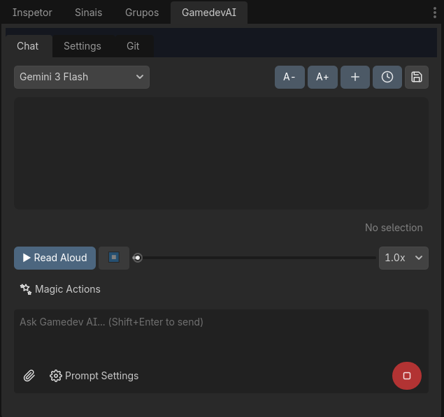

# 完整 UI 指南 (所有按钮)

本页描述了 Godot 编辑器内 Gamedev AI 界面中的**每个按钮、开关和控件**。

## 🗂️ 主选项卡 (Main Tabs)

该插件在面板顶部有 **3 个选项卡**：
- **Chat** — 与 AI 的主要通信面板。
- **Settings** (设置) — API 密钥管理、预设、提示词和索引。
- **Git** — 与 GitHub 集成的原生版本控制。

---

## 💬 聊天选项卡 (Chat Tab)

### 顶部栏
| 按钮 | 功能 |
|-------|--------|
| **Preset Selector** | 用于在不同提供商/模型设置（如 "Gemini 3.1", "GPT-4o"）之间快速切换的下拉菜单。 |
| **A-** / **A+** | 减小或增大聊天中的字体大小。 |
| **+ New Chat** | 删除当前对话并启动一个全新的会话。 |
| **⊙ History** | 所有过去对话的下拉菜单。点击其中一个以恢复该会话的完整上下文。 |
| **💾 Summarize to Memory** | 向 AI 发送自动提示，以总结当前对话的架构决策并将其存储在项目的持久记忆中。 |

### 聊天区域 (OutputDisplay)
- 显示带有 **粗体**、*斜体*、`内联代码`和代码块语法高亮的 BBCode 格式消息。
- 项目文件的可点击链接（点击即可在编辑器中打开它们）。
- 突出显示文本时会出现悬浮的 **Copy** 按钮，以便快速复制。

### TTS 播放器 (文字转语音)

| 控件 | 功能 |
|----------|--------|
| **▶ 大声朗读** | 将 AI 的最后一次回答转化为音频并播放。非常适合在编程时听取解释。 |
| **⏹ Stop** | 停止音频播放。 |
| **进度条** | 用于音频快进或快退。 |
| **速度 (1.0x - 2.0x)** | 控制播放节奏。 |

### 快速操作按钮
| 按钮 | 功能 |
|-------|-----------|
| **✧ 重构 (Refactor)** | 将编辑器中突出显示的代码与“Refactor this code”提示一起发送。AI 分析并提议结构性改进。 |
| **◆ 修复 (Fix)** | 将突出显示的代码与“Fix errors in this code”一起发送。AI 识别错误并生成修复。 |
| **💡 解释 (Explain)** | 将突出显示的代码与“Explain what this code does”一起发送。AI 用中文解释每个部分。 |
| **↺ 撤销 (Undo)** | 撤销 AI 在项目中执行的最后一次操作（使用 Godot 的撤销/重做系统）。 |
| **🖥 修复控制台 (Fix Console)** | 从 Godot 输出控制台读取最新红色错误，并将其直接发送给 AI 进行修复提议。 |

### 输入区域
| 元素 | 功能 |
|----------|--------|
| **文本字段** | 输入您的消息。按 `Shift + Enter` 发送。 |
| **📎 附件 (Attach)** | 打开文件选择器以将图像、脚本或任何文件附加到提示中。 |
| **➤ 发送 (Send)** | 将消息发送给 AI 处理。 |
| **拖放 (Drag & Drop)** | 将场景树节点或文件系统文件直接拖到文本字段或聊天区域。AI 将接收完整元数据。 |

### 提示词设置 (Prompt Settings - 下拉菜单)
这些选项集中在发送按钮旁的 ⚙️ 图标下。

| 设置 | 功能 |
|--------|--------|
| **包含上下文 (Include Context)** | 激活后，插件会自动将编辑器中当前打开的脚本内容附加到发送的消息中。 |
| **发送截图 (Send Screenshot)** | 激活后，它会自动对 Godot 窗口进行截图，并随消息发送给 AI 进行视觉分析。 |
| **先制定计划 (Plan First)** | 激活后，AI 将不会直接编写代码，而是先回复详细的计划。审查后，点击出现的“Execute Plan”按钮开始编码。 |
| **观察模式 (Watch Mode)** | 激活后，AI 会自动监控 Godot 输出控制台。如果运行游戏时检测到关键错误，它会自动提议修复。 |

---

## ⚙️ 设置选项卡 (Settings Tab)

### 预设管理
| 元素 | 功能 |
|----------|--------|
| **Preset Selector** | 选择已保存预设的下拉菜单。 |
| **Add** | 创建一个新的空预设。 |
| **Edit** | 打开编辑面板（名称、提供商、API 密钥、基础 URL、模型）。 |
| **Delete** | 永久删除所选预设。 |
| **Done Editing** | 关闭编辑面板并保存更改。 |

### 预设编辑字段
| 字段 | 描述 |
|-------|-----------|
| **Preset Name** | 用于标识的显示名称（例如 "Gemini 3.1 Free"）。 |
| **Provider** | “Gemini”和“OpenAI / OpenRouter”之间的下拉选择。 |
| **API Key** | 您所选提供商的 API 密钥。 |
| **Base URL** | 基础 API URL（仅适用于 OpenAI/OpenRouter）。 |
| **Model Name** | 模型的准确名称（例如 `gemini-2.5-flash`, `gpt-4o`）。 |

### 语言
| 元素 | 功能 |
|----------|--------|
| **Language Selector** | 选择界面和 AI 回答语言（中文、Português BR、English 等）的下拉菜单。 |

### 自定义系统提示 (Custom System Prompt)
一个大型文本字段，用于设置 AI 将始终遵循的固定规则。示例：*"对于所有函数使用静态类型。用中文注释。"*

| 按钮 | 功能 |
|-------|--------|
| **✨ 增强指令 (AI)** | 将您当前的指令发送给 AI，以便自动改进（技术细节、最佳实践）。接受前可预览。 |

### 矢量数据库 (Vector Database)
| 元素 | 功能 |
|----------|--------|
| **File List** | 带有索引状态的所有项目 `.gd` 文件的视觉列表。 |
| **🔍 Scan Changes** | 扫描项目自上次索引以来新增、更改或删除的文件。 |
| **⚡ Index Codebase** | 通过 Embeddings API 开始对所有更改后的脚本进行矢量索引。 |

---

## 🐙 Git 选项卡 (Git Tab)

### 初始设置
| 元素 | 功能 |
|----------|--------|
| **Initialize Repository** | 在项目文件夹中初始化 Git 存储库（如果不存在）。 |
| **Remote URL** | 用于粘贴 GitHub 存储库 URL 的字段（例如 `https://github.com/user/repo.git`）。 |
| **Set Remote** | 设置远程存储库的 URL。 |

### 主要操作
| 按钮 | 功能 |
|-------|--------|
| **🔃 刷新状态** | 更新 Git 状态（更改/未跟踪的文件、当前分支）。 |
| **⬇️ 拉取 (Pull)** | 从远程存储库下载最新更改。 |
| **✨ 自动生成提交消息** | AI 分析所有差异 (Diff) 并自动生成专业提交消息。 |
| **提交并同步 (Push)** | 提交带有消息的所有更改并推送到 GitHub。 |

### 分支
| 元素 | 功能 |
|----------|--------|
| **Branch Label** | 显示当前分支名称。 |
| **Branch Name Input** | 输入新分支或现有分支名称的字段。 |
| **Checkout/Create Branch** | 创建新分支或切换到现有分支。 |

### 紧急操作
| 按钮 | 功能 |
|-------|--------|
| **⚠️ 撤销未提交更改** | 放弃所有未提交的本地更改（重置为上次提交）。需要确认。 |
| **⚠️ 强制拉取覆盖** | 从云端下载并替换精确状态，完全覆盖您的整个本地文件夹。需要确认。 |
| **⚠️ 强制推送** | 将本地状态推送到远程存储库并覆盖那里的历史记录。谨慎使用！ |

---

## 📋 差异面板 (代码审查)

当 AI 生成或更改代码时，聊天中会出现一个差异面板：

| 元素 | 功能 |
|----------|--------|
| **差异视图 (Diff View)** | 红色删除行和绿色新增行的并排视图。 |
| **应用更改 (Apply Changes)** | 接受更改并将其应用到实际文件。操作记录在 Godot 撤销/重做中。 |
| **跳过 (Skip)** | 拒绝更改。不更改任何文件。 |
